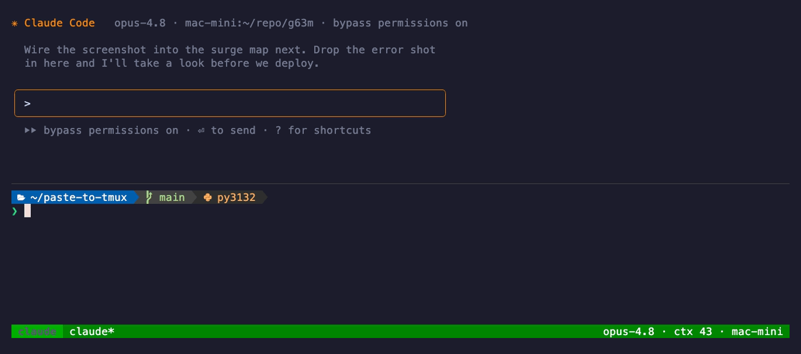

# paste-to-tmux

**Drop a file from your laptop straight into a remote terminal — and into the AI coding agent running inside it.**



You're SSH'd (or [mosh'd](https://mosh.org)) into a box, working in an interactive agent — `claude`, `codex`, `aider`, a REPL. You want to hand it a screenshot. Every option today hurts:

- [`croc`](https://github.com/schollz/croc) / [`magic-wormhole`](https://github.com/magic-wormhole/magic-wormhole) — you paste a transfer code *into the remote shell*, which is miserable when that shell is running a full-screen TUI.
- `scp` — a second terminal, then hand-type the remote path.
- Cloud upload → download → hunt for the path. Slow.

`paste-to-tmux` does it in one command, fired from a second pane on your laptop:

```
❯ paste-to-tmux mac-mini
No image in clipboard. Drag file(s)/folder(s) here, then press Enter:
> ~/Desktop/error.png
↑ error.png (84K) -> mac-mini ...
  ✓ error.png in 1s
Sent 1 item(s) in 1s -> mac-mini tmux claude:0.0
```

It `scp`s the file over and **types the absolute remote path straight into the agent's prompt** via `tmux send-keys` — landing in the input line, ready to send, even while a full-screen program owns the pane. No transfer codes. No hand-typed paths. Nothing to install on the remote.

## Works over mosh, too

`paste-to-tmux` opens its *own* `ssh`/`scp` connection, so it doesn't care how your interactive session reached the box — plain ssh, [`mosh`](https://mosh.org), a phone SSH app, whatever. That matters most for mosh: mosh keeps your session alive as you roam café → subway → home, but it has **no file transfer at all**. This is the missing piece — drop a file into your mosh + tmux session without giving up the roaming.

## Install

```bash
# straight from HEAD, no tap needed
brew install --HEAD https://raw.githubusercontent.com/kentaccn/paste-to-tmux/main/Formula/paste-to-tmux.rb
```

Or from a clone: `git clone https://github.com/kentaccn/paste-to-tmux && cd paste-to-tmux && ./install.sh`

You install **one tool, in one place** — your laptop. The remote needs only an SSH server and `tmux`, which you already have if you SSH in and work in tmux. `pngpaste` is optional (`brew install pngpaste`) for a faster clipboard-image path; without it, macOS's built-in `osascript` is used.

## Usage

`<host>` is anything SSH understands — a `Host` alias from your `~/.ssh/config`, or `user@1.2.3.4`. Passwordless key auth is strongly recommended so transfers don't prompt.

```bash
paste-to-tmux <host>                 # clipboard image → active pane; else prompts you to drag file(s)
paste-to-tmux <host> <target>        # explicit tmux target, e.g. main:0.0
paste-to-tmux <host> [target] -f F…  # send specific file(s)/folder(s), no prompt
paste-to-tmux <host> -l              # list attached tmux panes on <host>
paste-to-tmux setup [host]           # guided first-time checks (start here)
```

- **Target:** with no target, it picks the most-recently-active attached pane on the host.
- **Multiple items:** drag several at once; folders go recursively (`scp -r`); paths with spaces are fine.
- **Where files land:** `~/.cache/tmux-paste/<timestamp>/` on the remote, original filenames kept.

New here? Run `paste-to-tmux setup <host>` — it checks your local tools, your SSH login, and tmux on the remote, and offers to make a one-word shortcut (so `paste-to-myhost` becomes `paste-to-tmux my-host`).

> **`setup` does not create the SSH connection.** `<host>` must already work as `ssh <host>` on its own — i.e. a `Host` block in `~/.ssh/config`, or a literal `user@1.2.3.4`. Setup only *checks* that host and, optionally, saves you a shorter name for it.

## How it works

```
clipboard image ─┐
                 ├─►  scp to  ~/.cache/tmux-paste/<ts>/  ─►  tmux send-keys '<abs path>'  ─►  agent prompt
dragged file(s) ─┘     (folders via scp -r)                 into the active/target pane
```

Pure shell + `ssh`/`scp`/`tmux`. No daemon, no receiver, no dependencies beyond those. The path and tmux target are shell-quoted, and `send-keys -l` sends them literally, so filenames can't inject keystrokes.

<details>
<summary>Publishing a Homebrew release (maintainers)</summary>

The repo ships a formula at [`Formula/paste-to-tmux.rb`](Formula/paste-to-tmux.rb).

```bash
git push -u origin main && git push origin v0.1.0
curl -sL https://github.com/kentaccn/paste-to-tmux/archive/refs/tags/v0.1.0.tar.gz | shasum -a 256
# paste that hash into the sha256 "..." line in the formula, commit, push
```

To offer `brew install kentaccn/tap/paste-to-tmux`, publish a `homebrew-tap` repo and copy the formula into its `Formula/` dir. Until then, the `--HEAD` URL above works with no tap.
</details>

## Credits

Idea and direction by [Kenta](https://github.com/kentaccn). Code written with [Codex](https://github.com/openai/codex) and [Claude Code](https://claude.com/claude-code) — pointed at the problem by a human who knew it was worth solving. Contributions welcome; see [CONTRIBUTING.md](CONTRIBUTING.md).

MIT — see [LICENSE](LICENSE).
